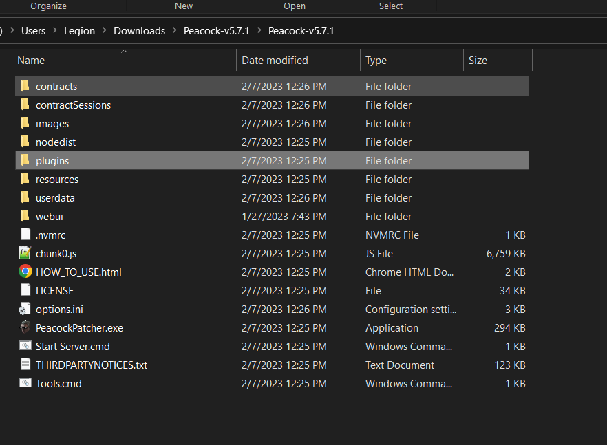

Peacock has lots of goodies packed in for our users.
Here's a peek at our custom content!

## Elusive Targets

Within Peacock, you can replay Elusive Targets without any time limit on restarts (unlike Elusive Target Arcade), and without a time limit.

-   **How to Play:**
    -   After starting up Hitman 3 in Peacock, go to `Career` -> `Elusive Targets` in-game.
-   See the [Plugins](#plugins) section for information on installing "The Brothers" Elusive Target (cut content) in Hitman 3.

## Escalations

-   **Custom Peacock Escalations**

    -   Peacock supports custom (Peacock original) escalations. These escalations are available in-game by default. You can see some custom escalations listed in the [Roadmaps](./roadmaps.mdx) as well.

-   **Official Server Escalations and Legacy Escalations**

    -   Peacock also supports all official server escalations, including Hitman 2016 escalations that have not been ported to Hitman 2 or 3 (legacy escalations). These escalations are available in-game by default.

-   Note: You can select specific escalation levels to start on using the Escalation Level Picker tool, as explained [here](./intel/loadout-profiles-elp.md#escalation-level-picker)

## Peacock Standalone Custom Missions

Peacock has two custom missions that are standalone (these missions are neither escalations nor contracts, but are more fleshed out "bonus missions"):

-   **Traditions of the Trade**
    -   Can be accessed in `Destinations` > `Bangkok` in-game
-   **The Lee Hong Assassination**
    -   Can be accessed in `Destinations` > `Chongqing` in-game

## Contracts Mode

Peacock supports both official server and custom Peacock contracts.

-   **Featured contracts**
    -   This includes custom (Peacock original) contracts created by Peacock dev team. You can see some of these custom featured contracts [here](./roadmaps.mdx).
        -   **Note: Official Servers Featured Contracts are not included.**
    -   How to Play:
        -   Go to `Game Modes` -> `Contracts` -> `Featured` menu in-game
-   **User Created, Official Server Contracts**
    -   How to Install:
        -   Note: This only works while the HITMAPS bot is authenticated for the platform in question. [More info on how to authenticate the HITMAPS bot here](https://bot.hitmaps.com/).
            -   If you want to check if HITMAPS bot is online, run the command `/botstatus` in the `#bot-spam` channel in the Peacock Discord. Note that the `/botstatus` command only updates every 10 minutes.
            -   Note: Downloaded official servers contracts are compatible with every game engine, assuming said game engine contains the relevant maps. For example, if you download a contract from Sapienza (Season 1 map) in Hitman 3 engine, you can play this contract in Hitman 2016 and Hitman 2 engine with Peacock as well. However, if you download a contract from Sgail (Season 2 map), then you can't play this contract in the Hitman 2016 engine as the Hitman 2016 engine doesn't contain any Season 2 maps.
        -   Go to `Game Modes` -> `Contracts` -> `Contract Lookup` menu in-game.
        -   Enter the official server contract ID (**Contracts from every platform except Nintendo Switch are supported for this**).
        -   The contract will now be downloaded in your `Contracts` folder.
    -   How to Play: Go to `Game Modes` -> `Contracts` -> `My Contracts` in-game to play.
-   **User Created, Peacock Contracts**
    -   How to Install:
        -   Download the contracts `.json` file from the `share-contracts` channel in Peacock Discord. Install this `.json` file to your `Contracts` folder, [as shown in this image](../static/img/./contracts_folder.png).
    -   How to Create Your Own:
        -   If you create a contract in-game while in Peacock server, your contract will be saved as an `.json` file in `Contracts` folder, [as shown in this image](../static/img/./contracts_folder.png).
        -   Be sure to share your `.json` file in Peacock Discord's `share-contracts` channel if you want others to play your custom Peacock contract.
    -   How to Play:
        -   Go to `Game Modes` -> `Contracts` -> `My Contracts` in-game to play.

## Plugins

Peacock supports a broad variety of server side mods (plugins). These include, but are not limited to:

-   Kill Everyone Mode
    -   All real NPC's marked as targets, can get Silent Assassin rating back after killing everyone.
    -   Note: Very buggy for maps with 200+ targets, guns may jam randomly. You may need to start by melee killing people.
-   Sarajevo Six
    -   Bonus Missions otherwise only available in Hitman 2016 Playstation version.
    -   Installation Instructions: https://github.com/solderq35/hitman-tech-tips/blob/main/modding/sarajevo_six.md
-   Brothers Elusive Target (Cut Content)
    -   File Download: https://www.nexusmods.com/hitman3/mods/375?tab=files
    -   Install the main portion of the mod (the file not marked "Peacock Plugin") through Simple Mod Framework. Install the "Peacock Plugin" portion of the mod by putting it into your Peacock Install folder. Read the Sarajevo Six instructions above for guidance if confused about either of those steps.
-   Plugins to add otherwise unused weapons to the game
-   Plugins to modify existing weapons and disguises

### How to Install Plugins

-   Broadly speaking, to install plugins, go to `#plugin-releases` in the Peacock Discord and download a plugin you are interested in.
-   Then, install it to the same folder that `Start Server.cmd` and `peacockpatcher.exe` are in.
-   Alternatively, create a folder named `plugins`, and then put your plugins there, to organize your files better.
    -   Example: 
-   Be sure to check for any further instructions in the `#plugin-releases` channel for a given plugin, as certain plugins may require further installation steps or are incompatible with newer versions of Peacock.

**Note: Plugins are only a small portion of the Hitman modding scene. Many Hitman mods are done client-side and out of scope of Peacock.** More general-use client-side mods, outside the scope of Peacock, are aggregated here:

-   [NexusMods](https://www.nexusmods.com/hitman3)
-   [Glacier Modding Discord](https://discord.com/invite/6UDtuYhZP6)
